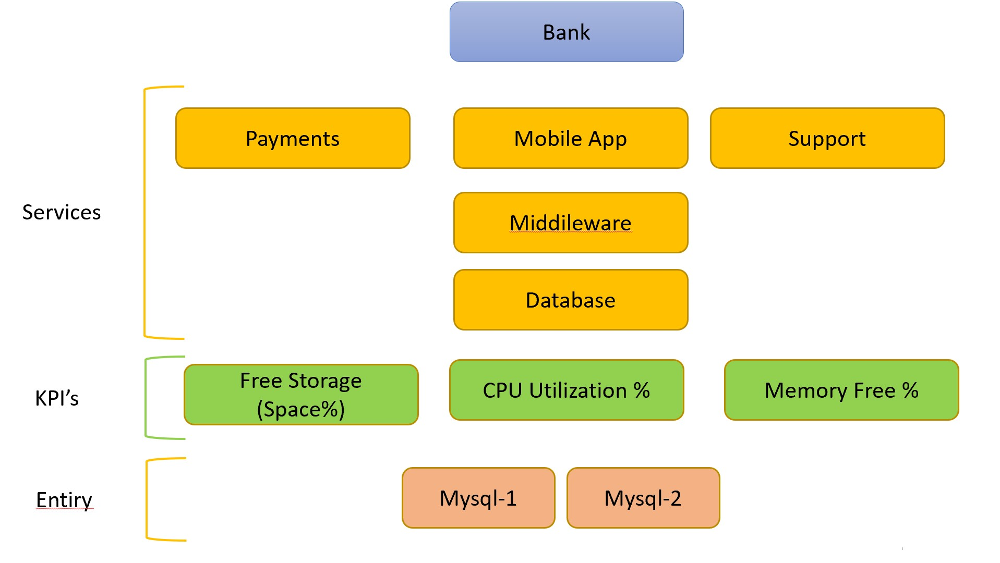
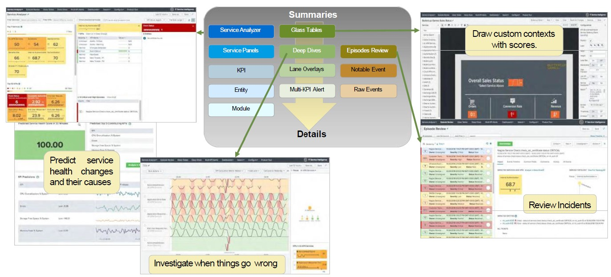

# Splunk IT Service Intelligence

<h2>Introduction</h2>
- Operation analytics on basis of services and KPI's woth machine learning capabilities. 
- You define <b>Services</b> which can analyse. These services's health is determined by <b><i>Key Performance Indicators (KPI)</i></b> - Availablility, Performance, Latency, Durability. 
- Create <b>Glass tables visualisation</b> to provide context to the status of your metrics. 
- <b>Deep Dive </b> are used to investigate performance probles and identify anomalies.  
- <b>Correlation searches</b> are used to alert unkown combination of KPI results. 

<h2>ITSI Preperation</h2>
<ol>
<li>Define Goals & Objectives</li>
<li>Define Scope</li>
<li>Creative service Decomposition</li>
<li>Define KPI's</li>
<li>Define Thresholds</li>
<li>Identify Data sources</li>
<li>Onboard missing data</li>
</ol>
------ITSI Read-------
<ol>
<li>Create Services & Dependencies</li>
<li>Create KPI's & Tune Thresholds</li>
<li>Create Deep Dives</li>
<li>Create Glasstables</li>
<li>Create Multi-KPI alerts</li>
<li>Gain insights & show value</li>
</ol>

<b>Service Monitoring use cases</b>
    - IT Infrastructure
    - Policy Services
    - Call center monitoring
    - Transaction troubleshooting.

<h2>ITSI User Interface</h2>

<b>Service Analyser:</b> Monitor overall services and KPI status. 
<b>Episode Review:</b> Investigate issues. 
<b>Glass Tables:</b> Visualisation tools for monitoring services. 
<b>Deep Dives:</b> Identify & troibleshoot issues. 
<b>Multi KPI Alerts: </b> (Admin) Searched create notable events by KPI Status. 
<b>Dashboards:</b>Reports, dashboards, pivots and ad-hoc searche tools. 

<h2>Notes:</h2>
    - Splunk ITSI is not compatible on search heads with Splunk Security installed. 
    - ITSI often requires an increase of hardware resources above base splunk requirements. 
    - The number of KPI's & entities will increase the number of indexers required. 
    - Primary capacity factors to consider: Avg KPI run time, frequence of KPI searches, no of entities used in KPI searches. 
    - Deployment capacity: 
    <code>index=_introspection sourcetype=splunk_resource_usage component=Hostwide earliest=-5m | timechart avg(data.cpu_user_pct) by host</code> 
    if it takes more than 5secs to complete, it can indicate that your current deployment hardware configuration will cause ITSI to under-performe. 
    - Ensure Java is installed on search heads: Required for anomaly detection and event management 
    - Predictive Analytics requires the Splunk Machine Learning Toolkit 