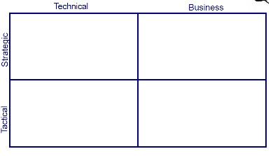

# Glass Tables as Design Tools

Requirements discussions frequently focus on visual displays—glass tables.
The relationships between the values on the displays can disclose services and inter-service relationships

